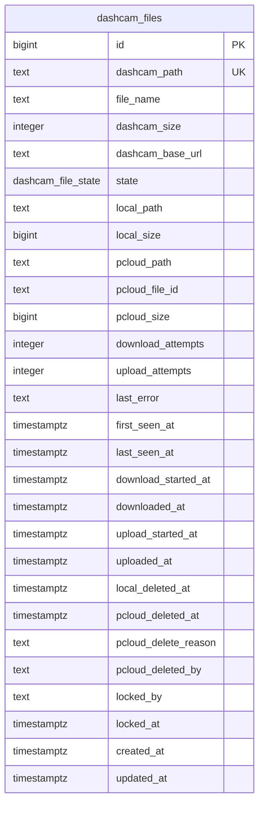

# Database Schema

Related docs: [overview](../multi-service-design.md), [shared contracts](shared-contracts.md), [operations](operations.md), [dashcam-db-schema](../services/db-schema.md).

The shared database is the pipeline queue, state store, and audit trail. `dashcam-db-schema` owns this schema and all migrations.

## Entity Diagram



## Migration Layout

Repo: `dashcam-db-schema`

```text
dashcam-db-schema/
|-- .github/workflows/deploy.yml
|-- README.md
|-- migrations/
|   |-- 001_create_dashcam_file_state.sql
|   |-- 002_create_dashcam_files.sql
|   |-- 003_create_dashcam_files_indexes.sql
|   `-- 004_create_updated_at_trigger.sql
|-- scripts/
|   |-- apply_migrations.py
|   `-- check_migrations.py
|-- tests/
|   `-- test_migrations.py
|-- config/
|   `-- app.env.example
|-- Dockerfile
|-- docker-compose.yml
`-- requirements.txt
```

## Migration 001: State Type

```sql
CREATE TYPE dashcam_file_state AS ENUM (
    'listed',
    'downloading',
    'downloaded',
    'download-failed',
    'uploading',
    'uploaded',
    'upload-failed'
);
```

## Migration 002: Main Table

```sql
CREATE TABLE dashcam_files (
    id BIGSERIAL PRIMARY KEY,
    dashcam_path TEXT NOT NULL UNIQUE,
    file_name TEXT NOT NULL,
    dashcam_size INTEGER NOT NULL,
    dashcam_base_url TEXT NOT NULL,
    state dashcam_file_state NOT NULL DEFAULT 'listed',

    local_path TEXT,
    local_size BIGINT,
    pcloud_path TEXT,
    pcloud_file_id TEXT,
    pcloud_size BIGINT,

    download_attempts INTEGER NOT NULL DEFAULT 0,
    upload_attempts INTEGER NOT NULL DEFAULT 0,
    last_error TEXT,

    listed_at TIMESTAMPTZ NOT NULL DEFAULT now(),
    first_seen_at TIMESTAMPTZ NOT NULL DEFAULT now(),
    last_seen_at TIMESTAMPTZ NOT NULL DEFAULT now(),
    download_started_at TIMESTAMPTZ,
    downloaded_at TIMESTAMPTZ,
    upload_started_at TIMESTAMPTZ,
    uploaded_at TIMESTAMPTZ,
    local_deleted_at TIMESTAMPTZ,
    pcloud_deleted_at TIMESTAMPTZ,
    pcloud_delete_reason TEXT,
    pcloud_deleted_by TEXT,

    locked_by TEXT,
    locked_at TIMESTAMPTZ,
    created_at TIMESTAMPTZ NOT NULL DEFAULT now(),
    updated_at TIMESTAMPTZ NOT NULL DEFAULT now(),

    CONSTRAINT dashcam_files_path_record_prefix
        CHECK (dashcam_path LIKE '/Record/%'),
    CONSTRAINT dashcam_files_size_positive
        CHECK (dashcam_size > 0),
    CONSTRAINT dashcam_files_download_attempts_nonnegative
        CHECK (download_attempts >= 0),
    CONSTRAINT dashcam_files_upload_attempts_nonnegative
        CHECK (upload_attempts >= 0)
);
```

## Migration 003: Indexes

```sql
CREATE INDEX dashcam_files_state_id_idx ON dashcam_files (state, id);

CREATE INDEX dashcam_files_download_queue_idx
    ON dashcam_files (state, download_attempts, id)
    WHERE state = 'listed';

CREATE INDEX dashcam_files_upload_queue_idx
    ON dashcam_files (state, upload_attempts, id)
    WHERE state = 'downloaded';

CREATE INDEX dashcam_files_cleanup_idx
    ON dashcam_files (state, local_deleted_at, id)
    WHERE state = 'uploaded';

CREATE INDEX dashcam_files_pcloud_retention_idx
    ON dashcam_files (uploaded_at, id)
    WHERE state = 'uploaded'
      AND pcloud_path IS NOT NULL
      AND pcloud_deleted_at IS NULL;

CREATE INDEX dashcam_files_last_seen_idx ON dashcam_files (last_seen_at DESC);
CREATE INDEX dashcam_files_updated_idx ON dashcam_files (updated_at DESC);
```

## Migration 004: Updated Timestamp

```sql
CREATE OR REPLACE FUNCTION set_updated_at()
RETURNS trigger AS $$
BEGIN
    NEW.updated_at = now();
    RETURN NEW;
END;
$$ LANGUAGE plpgsql;

CREATE TRIGGER dashcam_files_set_updated_at
BEFORE UPDATE ON dashcam_files
FOR EACH ROW
EXECUTE FUNCTION set_updated_at();
```

## State Invariants

| State | Required fields |
| --- | --- |
| `listed` | `dashcam_path`, `dashcam_size`, `dashcam_base_url`, `first_seen_at`, `last_seen_at` |
| `downloading` | `download_started_at`, `locked_by`, `locked_at` |
| `downloaded` | `local_path`, `local_size`, `downloaded_at` |
| `download-failed` | `last_error`, `download_attempts > 0` |
| `uploading` | `upload_started_at`, `locked_by`, `locked_at` |
| `uploaded` | `pcloud_path`, `uploaded_at`; current pCloud presence also requires `pcloud_deleted_at IS NULL` |
| `upload-failed` | `last_error`, `upload_attempts > 0` |

These invariants should be enforced by service tests and operational checks. Avoid complex CHECK constraints for state-specific required fields because they make operator repair harder.

## Claim Patterns

Downloader claim:

```sql
WITH claimed AS (
    SELECT id
    FROM dashcam_files
    WHERE state = 'listed'
      AND download_attempts < %(max_attempts)s
    ORDER BY id
    LIMIT %(batch_size)s
    FOR UPDATE SKIP LOCKED
)
UPDATE dashcam_files f
SET
    state = 'downloading',
    download_attempts = f.download_attempts + 1,
    download_started_at = now(),
    locked_by = %(worker_id)s,
    locked_at = now(),
    last_error = NULL
FROM claimed
WHERE f.id = claimed.id
RETURNING f.*;
```

Uploader claim:

```sql
WITH claimed AS (
    SELECT id
    FROM dashcam_files
    WHERE state = 'downloaded'
      AND upload_attempts < %(max_attempts)s
    ORDER BY id
    LIMIT %(batch_size)s
    FOR UPDATE SKIP LOCKED
)
UPDATE dashcam_files f
SET
    state = 'uploading',
    upload_attempts = f.upload_attempts + 1,
    upload_started_at = now(),
    locked_by = %(worker_id)s,
    locked_at = now(),
    last_error = NULL
FROM claimed
WHERE f.id = claimed.id
RETURNING f.*;
```

Cleaner claim:

```sql
WITH claimed AS (
    SELECT id
    FROM dashcam_files
    WHERE state = 'uploaded'
      AND local_path IS NOT NULL
      AND local_deleted_at IS NULL
    ORDER BY uploaded_at NULLS LAST, id
    LIMIT %(batch_size)s
    FOR UPDATE SKIP LOCKED
)
SELECT f.*
FROM dashcam_files f
JOIN claimed ON claimed.id = f.id;
```

Cleaner should update `local_deleted_at` only after the filesystem operation succeeds or after confirming the file is already absent.

Retention candidate query:

```sql
SELECT id, dashcam_path, pcloud_path, pcloud_file_id, pcloud_size, uploaded_at
FROM dashcam_files
WHERE state = 'uploaded'
  AND pcloud_path IS NOT NULL
  AND pcloud_deleted_at IS NULL
ORDER BY uploaded_at ASC, id ASC
LIMIT %(batch_size)s;
```

Retention deletion update:

```sql
UPDATE dashcam_files
SET
    pcloud_deleted_at = now(),
    pcloud_delete_reason = %(reason)s,
    pcloud_deleted_by = %(worker_id)s,
    last_error = NULL
WHERE id = %(id)s
  AND state = 'uploaded'
  AND pcloud_deleted_at IS NULL;
```

## Stale Active Rows

Rows can stay in `downloading` or `uploading` if a worker crashes after claiming work. Operators can requeue stale active rows after checking logs:

```sql
UPDATE dashcam_files
SET
    state = 'listed',
    locked_by = NULL,
    locked_at = NULL,
    last_error = 'operator requeued stale downloading row'
WHERE state = 'downloading'
  AND locked_at < now() - interval '2 hours';
```

```sql
UPDATE dashcam_files
SET
    state = 'downloaded',
    locked_by = NULL,
    locked_at = NULL,
    last_error = 'operator requeued stale uploading row'
WHERE state = 'uploading'
  AND locked_at < now() - interval '2 hours';
```

## Migration Pipeline

The `dashcam-db-schema` GitHub Actions workflow should:

1. Run SQL linting or parse checks.
2. Start a temporary PostgreSQL container.
3. Apply all migrations from scratch.
4. Run schema assertions.
5. On `main`, SSH to deployment host `192.168.68.21` and run `scripts/apply_migrations.py` against PostgreSQL `192.168.68.22`.
6. Print the current migration version and table counts.

Production migrations should be additive by default. Destructive migrations require a manual backup and an explicit workflow dispatch input.
