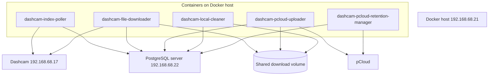

# Operations Guide

Related docs: [overview](../multi-service-design.md), [shared contracts](shared-contracts.md), [database schema](database-schema.md).

This guide covers shared deployment, monitoring, and recovery procedures for the dashcam multi-service pipeline.

## Deployment Topology

Dashcam services deploy to `192.168.68.21`. The legacy MediaWall service server
`192.168.68.84` is full and must not be used for these workloads. PostgreSQL is
on `192.168.68.22`; each service should use a `DATABASE_URL` with that host.



## Deployment Order

1. Deploy `dashcam-db-schema` and apply migrations.
2. Deploy `dashcam-index-poller`; verify rows appear in `listed`.
3. Deploy `dashcam-file-downloader`; verify rows progress to `downloaded`.
4. Deploy `dashcam-pcloud-uploader`; verify rows progress to `uploaded`.
5. Deploy `dashcam-local-cleaner`; verify `local_deleted_at` is populated.
6. Deploy `dashcam-pcloud-retention-manager` with conservative thresholds; verify dry-run style logs before allowing deletes.

## Standard GitHub Actions Pipeline

Each runtime repo should use the same deployment shape:

```yaml
name: Deploy

on:
  push:
    branches:
      - main

permissions:
  contents: read

env:
  DEPLOY_HOST: 192.168.68.21
  DEPLOY_USER: ${{ secrets.DEPLOY_USER }}
  DEPLOY_PATH: /home/${{ secrets.DEPLOY_USER }}/<repo-name>

jobs:
  test:
    runs-on: self-hosted
    steps:
      - uses: actions/checkout@v4
      - name: Install dependencies
        run: |
          python3 -m venv .venv
          .venv/bin/pip install -r requirements.txt
      - name: Run tests
        run: .venv/bin/python -m pytest

  deploy:
    runs-on: self-hosted
    needs: test
    steps:
      - uses: actions/checkout@v4
      - name: Sync files
        run: |
          rsync -avz --delete \
            --exclude '.git' \
            --exclude '.github' \
            --exclude '__pycache__' \
            --exclude '*.pyc' \
            --exclude '.pytest_cache' \
            --exclude 'config/app.env' \
            --exclude 'downloads' \
            ./ ${{ env.DEPLOY_USER }}@${{ env.DEPLOY_HOST }}:${{ env.DEPLOY_PATH }}/
      - name: Ensure config exists
        run: |
          ssh ${{ env.DEPLOY_USER }}@${{ env.DEPLOY_HOST }} \
            "cd ${{ env.DEPLOY_PATH }} && mkdir -p config && test -f config/app.env || cp config/app.env.example config/app.env"
      - name: Build and restart
        run: |
          ssh ${{ env.DEPLOY_USER }}@${{ env.DEPLOY_HOST }} << 'EOF'
            cd ${{ env.DEPLOY_PATH }}
            docker compose config --quiet
            docker compose down || true
            docker compose build
            docker compose up -d
            docker compose ps
          EOF
```

## Standard Runtime Folder Structure

```text
<repo-name>/
|-- .github/workflows/deploy.yml
|-- config/
|   `-- app.env.example
|-- src/
|   |-- __init__.py
|   |-- config.py
|   |-- db.py
|   |-- logging_config.py
|   `-- main.py
|-- tests/
|-- Dockerfile
|-- docker-compose.yml
|-- requirements.txt
`-- README.md
```

## Shared Secrets

| Secret | Used by | Storage |
| --- | --- | --- |
| `DEPLOY_USER` | GitHub Actions | GitHub repository secret |
| `DATABASE_URL` | all services | `config/app.env` on `192.168.68.21`; value points at PostgreSQL `192.168.68.22` |
| `PCLOUD_USERNAME` | uploader, retention manager | `config/app.env` on `192.168.68.21` |
| `PCLOUD_PASSWORD` | uploader, retention manager | `config/app.env` on `192.168.68.21` |

Do not commit real credentials. `config/app.env.example` should contain placeholders only.

## Health Checks

Minimum checks:

```sql
SELECT state, count(*)
FROM dashcam_files
GROUP BY state
ORDER BY state;
```

Freshness check:

```sql
SELECT max(last_seen_at) AS newest_dashcam_listing
FROM dashcam_files;
```

Failure check:

```sql
SELECT state, count(*)
FROM dashcam_files
WHERE state IN ('download-failed', 'upload-failed')
GROUP BY state;
```

pCloud retention view:

```sql
SELECT
    count(*) FILTER (WHERE pcloud_deleted_at IS NULL) AS current_pcloud_files,
    count(*) FILTER (WHERE pcloud_deleted_at IS NOT NULL) AS retention_deleted_files
FROM dashcam_files
WHERE state = 'uploaded';
```

Stuck active rows:

```sql
SELECT id, dashcam_path, state, locked_by, locked_at
FROM dashcam_files
WHERE state IN ('downloading', 'uploading')
  AND locked_at < now() - interval '2 hours'
ORDER BY locked_at;
```

## Recovery Queries

Reset a failed download:

```sql
UPDATE dashcam_files
SET
    state = 'listed',
    last_error = NULL,
    locked_by = NULL,
    locked_at = NULL
WHERE id = $1
  AND state = 'download-failed';
```

Reset a failed upload:

```sql
UPDATE dashcam_files
SET
    state = 'downloaded',
    last_error = NULL,
    locked_by = NULL,
    locked_at = NULL
WHERE id = $1
  AND state = 'upload-failed';
```

Requeue stale downloader rows:

```sql
UPDATE dashcam_files
SET
    state = 'listed',
    locked_by = NULL,
    locked_at = NULL,
    last_error = 'operator requeued stale downloader claim'
WHERE state = 'downloading'
  AND locked_at < now() - interval '2 hours';
```

Requeue stale uploader rows:

```sql
UPDATE dashcam_files
SET
    state = 'downloaded',
    locked_by = NULL,
    locked_at = NULL,
    last_error = 'operator requeued stale uploader claim'
WHERE state = 'uploading'
  AND locked_at < now() - interval '2 hours';
```

## Rollback

Runtime service rollback:

1. SSH to the deployment host `192.168.68.21`.
2. `cd ~/repo-name`.
3. `git checkout <known-good-sha>` if the host keeps git metadata, or redeploy the previous artifact.
4. `docker compose down`.
5. `docker compose build`.
6. `docker compose up -d`.
7. Check logs and state counts.

Schema rollback:

- Prefer forward fixes for schema changes.
- Before destructive migrations, take a DB backup.
- The first schema version should not need rollback; it only creates new tables/types.
