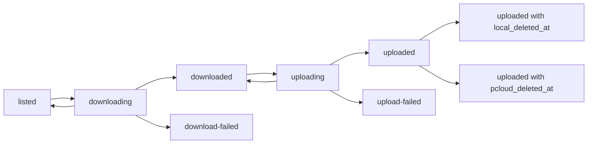

# Shared Contracts

Related docs: [overview](../multi-service-design.md), [database schema](database-schema.md), [operations](operations.md).

These contracts are used by all dashcam pipeline repos. They are intentionally explicit so each service can be built and deployed independently without redefining queue semantics.

## Repos

| Repo | Runtime container | Contract role |
| --- | --- | --- |
| `dashcam-db-schema` | none | Owns database migrations and schema documentation. |
| `dashcam-index-poller` | `dashcam-index-poller` | Produces `listed` rows from the BlackVue index. |
| `dashcam-file-downloader` | `dashcam-file-downloader` | Consumes `listed`, produces `downloaded` or `download-failed`. |
| `dashcam-pcloud-uploader` | `dashcam-pcloud-uploader` | Consumes `downloaded`, produces `uploaded` or `upload-failed`. |
| `dashcam-local-cleaner` | `dashcam-local-cleaner` | Cleans local files for `uploaded` rows. |
| `dashcam-pcloud-retention-manager` | `dashcam-pcloud-retention-manager` | Deletes oldest pCloud files for uploaded rows when storage thresholds are breached. |

## State Contract

| State | Owner | Meaning | Next automatic state |
| --- | --- | --- | --- |
| `listed` | poller | Complete file exists in the dashcam index and is ready to download. | `downloading` |
| `downloading` | downloader | A downloader worker has claimed the row. | `downloaded`, `listed`, or `download-failed` |
| `downloaded` | downloader | File exists at `local_path` and is ready to upload. | `uploading` |
| `download-failed` | downloader | Download retry budget is exhausted. | none |
| `uploading` | uploader | An uploader worker has claimed the row. | `uploaded`, `downloaded`, or `upload-failed` |
| `uploaded` | uploader | File has been uploaded to pCloud. Current pCloud presence requires `pcloud_deleted_at IS NULL`. | none |
| `upload-failed` | uploader | Upload retry budget is exhausted. | none |

Failed states are operator-visible stops. A service must not automatically claim `download-failed` or `upload-failed` rows. Operator reset queries are documented in [operations.md](operations.md).

## Shared Flow



## Row Ownership Rules

- Poller may insert rows and update `dashcam_size`, `last_seen_at`, and `updated_at` for existing rows.
- Downloader may update rows in `listed` or `downloading`.
- Uploader may update rows in `downloaded` or `uploading`.
- Cleaner may update only `uploaded` rows where `local_deleted_at IS NULL`.
- Retention manager may update only `uploaded` rows where `pcloud_deleted_at IS NULL`.
- Operators may reset failed rows manually through documented SQL.
- Services must not delete `dashcam_files` rows.
- Services must not move a row backward except for retryable work return: `downloading -> listed` and `uploading -> downloaded`.

## Claim Contract

Workers claim rows with one transaction:

1. Select eligible rows using `FOR UPDATE SKIP LOCKED`.
2. Update the selected rows to the active state.
3. Increment the attempt counter.
4. Set `locked_by`, `locked_at`, `*_started_at`, and `updated_at`.
5. Commit before performing network or filesystem work.

This keeps DB locks short and prevents a worker crash from holding a long transaction open during downloads or uploads.

## Worker Identity

Every service instance must set `WORKER_ID`. Recommended value:

```text
<service-name>-<hostname>-<short-random-suffix>
```

`WORKER_ID` appears in logs and in `dashcam_files.locked_by`.

## Paths

Dashcam paths:

- Must start with `/Record/`.
- Must already be normalized.
- Must not contain `..`, backslashes, empty path segments, or trailing slash.
- Must be treated as untrusted input until validated.

Local paths:

- Must be under `DOWNLOAD_DIR`.
- Preserve the dashcam path without the leading slash, for example `/downloads/Record/name.mp4`.
- Final file names must never end in `.part`.
- `.part` is reserved for active or failed temporary transfers.

pCloud paths:

- Must be under `PCLOUD_DESTINATION_ROOT`.
- Preserve the local relative path by default, for example `/Dashcam/Record/name.mp4`.
- Must be stored in `dashcam_files.pcloud_path` after upload.
- Retention deletion must be recorded in `dashcam_files.pcloud_deleted_at`.
- Rows with `pcloud_deleted_at IS NOT NULL` should be treated as historical uploads, not current pCloud objects.

## Config Naming

Common variables:

```env
DATABASE_URL=postgresql://mediawall:<password>@192.168.68.22:5432/mediawall
WORKER_ID=<service-instance-id>
BATCH_SIZE=10
IDLE_SLEEP_SECONDS=10
LOG_LEVEL=INFO
```

Services should accept `LOG_LEVEL` values supported by Python logging: `DEBUG`, `INFO`, `WARNING`, `ERROR`.

## Logging Contract

Each log line should be JSON and include:

- `timestamp`
- `level`
- `logger`
- `version`
- `worker_id`
- `message`
- `file_id` when processing a DB row
- `dashcam_path` when available
- `state` when changing state
- `attempt` and `max_attempts` for retryable work
- `exception` for stack traces

## Metrics Contract

Each runtime service should expose counters through logs at minimum. If a metrics endpoint is later added, use these metric names:

| Metric | Type | Service |
| --- | --- | --- |
| `dashcam_index_polls_total` | counter | poller |
| `dashcam_index_poll_failures_total` | counter | poller |
| `dashcam_files_listed_total` | counter | poller |
| `dashcam_download_attempts_total` | counter | downloader |
| `dashcam_download_failures_total` | counter | downloader |
| `dashcam_upload_attempts_total` | counter | uploader |
| `dashcam_upload_failures_total` | counter | uploader |
| `dashcam_cleaned_files_total` | counter | cleaner |
| `dashcam_pcloud_retention_runs_total` | counter | retention manager |
| `dashcam_pcloud_retention_deleted_files_total` | counter | retention manager |
| `dashcam_pcloud_retention_delete_failures_total` | counter | retention manager |
