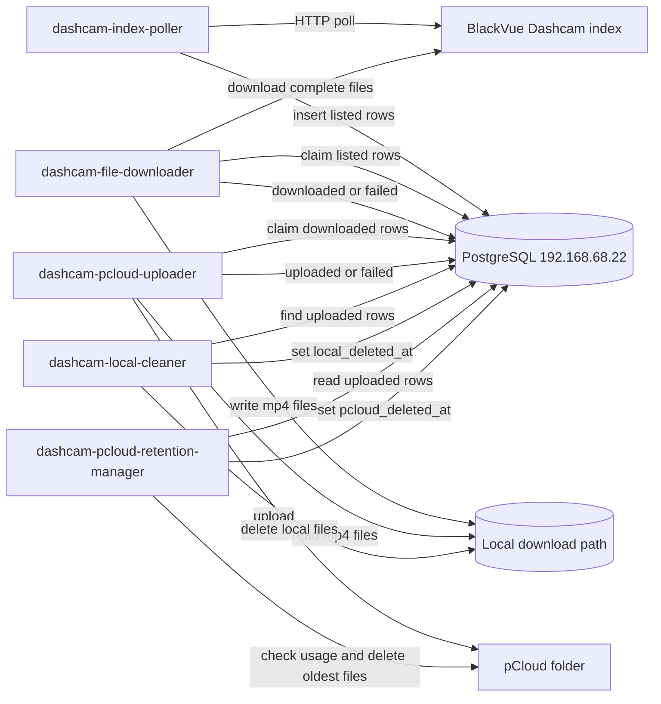
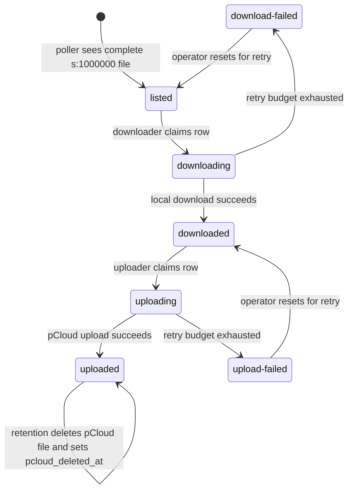
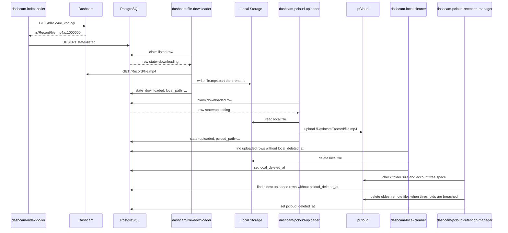

# Dashcam Multi-Service Downloader Design

## Summary

Split the deprecated `dashcam-downloader` worker into five independently
deployed runtime services plus one schema repo. The services coordinate through
the PostgreSQL server at `192.168.68.22` and run on the dashcam deployment host
at `192.168.68.21`.

| Repo | Service | Responsibility |
| --- | --- | --- |
| [`dashcam-index-poller`](services/index-poller.md) | `dashcam-index-poller` | Poll the dashcam VOD index and insert newly discovered complete files in `listed` state. |
| [`dashcam-file-downloader`](services/file-downloader.md) | `dashcam-file-downloader` | Claim `listed` files, download them to local storage, and mark them `downloaded` or `download-failed`. |
| [`dashcam-pcloud-uploader`](services/pcloud-uploader.md) | `dashcam-pcloud-uploader` | Claim `downloaded` files, upload them to pCloud, and mark them `uploaded` or `upload-failed`. |
| [`dashcam-local-cleaner`](services/local-cleaner.md) | `dashcam-local-cleaner` | Delete local files after successful upload and record cleanup metadata. |
| [`dashcam-pcloud-retention-manager`](services/pcloud-retention-manager.md) | `dashcam-pcloud-retention-manager` | Delete oldest pCloud files when the folder size or account free-space threshold is breached. |
| [`dashcam-db-schema`](services/db-schema.md) | none | Own database migrations and shared schema documentation. |

The old `dashcam-downloader` code is deprecated. Keep it only as a migration
reference until the split services are implemented; do not deploy new dashcam
workloads from it.

## Deployment Topology

| Role | Address | Notes |
| --- | --- | --- |
| Dashcam deployment host | `192.168.68.21` | Runs all split dashcam runtime services and the schema migration tooling. |
| Dashcam PostgreSQL server | `192.168.68.22` | Owns `dashcam_files` and migration history. |
| BlackVue dashcam | `192.168.68.17` | Source VOD index and MP4 recordings. |
| Legacy service server | `192.168.68.84` | Full; do not deploy new dashcam services here. |

Private repo creation command:

```bash
while IFS='|' read -r repo desc; do
  gh repo create "c0d3rb4b4/$repo" --private --description "$desc"
done <<'EOF'
dashcam-db-schema|PostgreSQL schema, migrations, and shared database contract for the dashcam media pipeline
dashcam-index-poller|Polls the BlackVue dashcam VOD index and records complete files in PostgreSQL
dashcam-file-downloader|Downloads listed BlackVue dashcam recordings to local storage using PostgreSQL-backed work claims
dashcam-pcloud-uploader|Uploads downloaded dashcam recordings from local storage to pCloud and updates PostgreSQL state
dashcam-local-cleaner|Cleans local dashcam recording files after successful pCloud upload
dashcam-pcloud-retention-manager|Manages pCloud dashcam retention by deleting oldest uploaded files when storage thresholds are breached
EOF
```

## Detailed Documents

Service-level designs:

- [dashcam-index-poller](services/index-poller.md)
- [dashcam-file-downloader](services/file-downloader.md)
- [dashcam-pcloud-uploader](services/pcloud-uploader.md)
- [dashcam-local-cleaner](services/local-cleaner.md)
- [dashcam-pcloud-retention-manager](services/pcloud-retention-manager.md)
- [dashcam-db-schema](services/db-schema.md)

Common references:

- [Shared contracts](common/shared-contracts.md)
- [Database schema](common/database-schema.md)
- [Operations guide](common/operations.md)

## Architecture



## Database Design

Use PostgreSQL as the shared queue and source of truth. Services must use transactions and `FOR UPDATE SKIP LOCKED` for claiming work so multiple replicas can run safely.

### Table: `dashcam_files`

```sql
CREATE TYPE dashcam_file_state AS ENUM (
    'listed',
    'downloading',
    'downloaded',
    'download-failed',
    'uploading',
    'uploaded',
    'upload-failed'
);

CREATE TABLE dashcam_files (
    id BIGSERIAL PRIMARY KEY,
    dashcam_path TEXT NOT NULL UNIQUE,
    file_name TEXT NOT NULL,
    dashcam_size INTEGER NOT NULL,
    dashcam_base_url TEXT NOT NULL,
    state dashcam_file_state NOT NULL DEFAULT 'listed',

    local_path TEXT,
    local_size BIGINT,
    pcloud_path TEXT,
    pcloud_file_id TEXT,
    pcloud_size BIGINT,

    download_attempts INTEGER NOT NULL DEFAULT 0,
    upload_attempts INTEGER NOT NULL DEFAULT 0,
    last_error TEXT,

    listed_at TIMESTAMPTZ NOT NULL DEFAULT now(),
    first_seen_at TIMESTAMPTZ NOT NULL DEFAULT now(),
    last_seen_at TIMESTAMPTZ NOT NULL DEFAULT now(),
    download_started_at TIMESTAMPTZ,
    downloaded_at TIMESTAMPTZ,
    upload_started_at TIMESTAMPTZ,
    uploaded_at TIMESTAMPTZ,
    local_deleted_at TIMESTAMPTZ,
    pcloud_deleted_at TIMESTAMPTZ,
    pcloud_delete_reason TEXT,
    pcloud_deleted_by TEXT,

    locked_by TEXT,
    locked_at TIMESTAMPTZ,
    created_at TIMESTAMPTZ NOT NULL DEFAULT now(),
    updated_at TIMESTAMPTZ NOT NULL DEFAULT now()
);

CREATE INDEX dashcam_files_state_id_idx ON dashcam_files (state, id);
CREATE INDEX dashcam_files_download_retry_idx
    ON dashcam_files (state, download_attempts, updated_at);
CREATE INDEX dashcam_files_upload_retry_idx
    ON dashcam_files (state, upload_attempts, updated_at);
CREATE INDEX dashcam_files_cleanup_idx
    ON dashcam_files (state, local_deleted_at)
    WHERE state = 'uploaded';
CREATE INDEX dashcam_files_pcloud_retention_idx
    ON dashcam_files (uploaded_at, id)
    WHERE state = 'uploaded'
      AND pcloud_path IS NOT NULL
      AND pcloud_deleted_at IS NULL;
```

### State Machine



`download-failed` and `upload-failed` mean the configured retry budget is exhausted. They are terminal until an operator resets the row to `listed` or `downloaded`. `uploaded` means upload completed successfully; current pCloud presence is represented by `pcloud_deleted_at IS NULL`.

## Service Designs

### `dashcam-index-poller`

Polls the dashcam index URL. If the call fails, it logs the failure and waits for the next poll without changing database state. A successful call parses all index entries and only inserts files where `s:1000000`.

Implementation rules:

- Accept inline, LF, and CRLF index formats.
- Treat `s:1000000` as the only complete-file marker.
- Reject paths that are not normalized `/Record/...` paths.
- Upsert by `dashcam_path`; existing rows only get `last_seen_at` and `dashcam_size` refreshed.
- Insert new complete files with `state='listed'`.
- Never delete database rows just because the dashcam no longer lists them.

Core query:

```sql
INSERT INTO dashcam_files (
    dashcam_path,
    file_name,
    dashcam_size,
    dashcam_base_url,
    state,
    first_seen_at,
    last_seen_at
)
VALUES ($1, $2, $3, $4, 'listed', now(), now())
ON CONFLICT (dashcam_path) DO UPDATE
SET
    dashcam_size = EXCLUDED.dashcam_size,
    last_seen_at = now(),
    updated_at = now();
```

Config:

```env
DATABASE_URL=postgresql://mediawall:<password>@192.168.68.22:5432/mediawall
DASHCAM_BASE_URL=http://192.168.68.17
DASHCAM_INDEX_PATH=/blackvue_vod.cgi
POLL_INTERVAL_SECONDS=60
COMPLETE_FILE_SIZE=1000000
REQUEST_TIMEOUT_SECONDS=30
LOG_LEVEL=INFO
```

### `dashcam-file-downloader`

Claims rows in `listed` state, marks them `downloading`, downloads the file to a configured local path, and finishes with `downloaded` or `download-failed`.

Implementation rules:

- Claim work in small batches with `FOR UPDATE SKIP LOCKED`.
- Write files under `DOWNLOAD_DIR` while preserving the camera path, for example `/downloads/Record/20260602_074033_PF.mp4`.
- Download to `<file>.part`, then atomically rename to the final path.
- Skip network work if the final local file already exists; record its size and mark `downloaded`.
- Increment `download_attempts` once per claimed row.
- On retryable failure, set `state='listed'` if attempts remain, otherwise `state='download-failed'`.
- Keep `last_error` short enough for logs and UI display.

Claim query:

```sql
WITH claimed AS (
    SELECT id
    FROM dashcam_files
    WHERE state = 'listed'
      AND download_attempts < $1
    ORDER BY id
    LIMIT $2
    FOR UPDATE SKIP LOCKED
)
UPDATE dashcam_files f
SET
    state = 'downloading',
    download_attempts = download_attempts + 1,
    download_started_at = now(),
    locked_by = $3,
    locked_at = now(),
    updated_at = now()
FROM claimed
WHERE f.id = claimed.id
RETURNING f.*;
```

Config:

```env
DATABASE_URL=postgresql://mediawall:<password>@192.168.68.22:5432/mediawall
DOWNLOAD_DIR=/downloads
WORKER_ID=dashcam-file-downloader-1
BATCH_SIZE=5
IDLE_SLEEP_SECONDS=10
REQUEST_TIMEOUT_SECONDS=30
MAX_DOWNLOAD_ATTEMPTS=3
RETRY_DELAY_SECONDS=10
LOG_LEVEL=INFO
```

### `dashcam-pcloud-uploader`

Claims rows in `downloaded` state, uploads local files to pCloud, and finishes with `uploaded` or `upload-failed`.

Implementation rules:

- Claim rows with `FOR UPDATE SKIP LOCKED`.
- Confirm `local_path` exists before upload; missing local files become `upload-failed` with a clear `last_error`.
- Upload to a configured pCloud root while preserving the `Record/...` relative path by default.
- Store `pcloud_path` and provider file id if the API returns one.
- Use idempotent upload behavior where possible: if the destination already exists and matches size, mark `uploaded`.
- Increment `upload_attempts` once per claimed row.
- On retryable failure, set `state='downloaded'` if attempts remain, otherwise `state='upload-failed'`.

Claim query:

```sql
WITH claimed AS (
    SELECT id
    FROM dashcam_files
    WHERE state = 'downloaded'
      AND upload_attempts < $1
    ORDER BY id
    LIMIT $2
    FOR UPDATE SKIP LOCKED
)
UPDATE dashcam_files f
SET
    state = 'uploading',
    upload_attempts = upload_attempts + 1,
    upload_started_at = now(),
    locked_by = $3,
    locked_at = now(),
    updated_at = now()
FROM claimed
WHERE f.id = claimed.id
RETURNING f.*;
```

Config:

```env
DATABASE_URL=postgresql://mediawall:<password>@192.168.68.22:5432/mediawall
PCLOUD_USERNAME=<set-username>
PCLOUD_PASSWORD=<set-password>
PCLOUD_DESTINATION_ROOT=/Dashcam
WORKER_ID=dashcam-pcloud-uploader-1
BATCH_SIZE=2
IDLE_SLEEP_SECONDS=15
MAX_UPLOAD_ATTEMPTS=3
RETRY_DELAY_SECONDS=30
LOG_LEVEL=INFO
```

### `dashcam-local-cleaner`

Finds uploaded rows that still have a local file and deletes them from local storage. The row remains in `uploaded` state; cleanup is recorded with `local_deleted_at`.

Implementation rules:

- Only process rows where `state='uploaded'`, `local_path IS NOT NULL`, and `local_deleted_at IS NULL`.
- Delete only paths under configured `DOWNLOAD_DIR`.
- If the file is already missing, set `local_deleted_at` anyway and record a warning in logs.
- Do not delete `.part` files owned by active downloads.
- Run continuously on an interval or as a scheduled container.

Config:

```env
DATABASE_URL=postgresql://mediawall:<password>@192.168.68.22:5432/mediawall
DOWNLOAD_DIR=/downloads
WORKER_ID=dashcam-local-cleaner-1
BATCH_SIZE=100
CLEANUP_INTERVAL_SECONDS=300
LOG_LEVEL=INFO
```

### `dashcam-pcloud-retention-manager`

Monitors pCloud storage and deletes oldest uploaded files from the configured pCloud folder when either the folder size reaches a configured maximum or overall pCloud free space drops below a configured percentage. The row remains in `uploaded` state and records pCloud deletion metadata.

Implementation rules:

- Query pCloud account usage and destination folder usage each interval.
- Start cleanup when folder size is at or above `PCLOUD_MAX_FOLDER_BYTES` or free percentage is below `PCLOUD_MIN_FREE_PERCENT`.
- Stop cleanup only after folder size is at or below `PCLOUD_TARGET_FOLDER_BYTES` and free percentage is at or above `PCLOUD_TARGET_FREE_PERCENT`.
- Delete oldest uploaded files first, ordered by `uploaded_at ASC, id ASC`.
- Only delete files under `PCLOUD_DESTINATION_ROOT`.
- Set `pcloud_deleted_at`, `pcloud_delete_reason`, and `pcloud_deleted_by` after remote deletion.
- Never delete local files and never delete PostgreSQL rows.

Config:

```env
DATABASE_URL=postgresql://mediawall:<password>@192.168.68.22:5432/mediawall
PCLOUD_USERNAME=<set-username>
PCLOUD_PASSWORD=<set-password>
PCLOUD_DESTINATION_ROOT=/Dashcam
PCLOUD_MAX_FOLDER_BYTES=536870912000
PCLOUD_TARGET_FOLDER_BYTES=483183820800
PCLOUD_MIN_FREE_PERCENT=10
PCLOUD_TARGET_FREE_PERCENT=15
RETENTION_INTERVAL_SECONDS=3600
BATCH_SIZE=100
MAX_DELETES_PER_RUN=500
REQUEST_TIMEOUT_SECONDS=60
WORKER_ID=dashcam-pcloud-retention-manager-1
LOG_LEVEL=INFO
```

## End-to-End Flow



## Shared Implementation Standards

- Language/runtime: Python 3.11.
- Packaging style: match the current `dashcam-downloader` structure with `src/`, `config/app.env.example`, `Dockerfile`, `docker-compose.yml`, `.github/workflows/deploy.yml`, `requirements.txt`, and tests.
- Logging: JSON logs with `service`, `version`, `worker_id`, row id, path, state, and attempt count.
- Database library: `psycopg` v3 or SQLAlchemy Core; avoid ORM-specific behavior for queue claiming.
- Migrations: `dashcam-db-schema` owns SQL migrations. Services should not auto-create tables at startup.
- Deployment: each service deploys independently to `192.168.68.21`, with
  shared access to PostgreSQL `192.168.68.22` and the configured download
  volume.

## Failure Handling

| Failure | Expected behavior |
| --- | --- |
| Dashcam offline | Poller logs request failure and waits for next poll. No row state changes. |
| Index has incomplete file | Poller skips entries where `s` is missing or not `1000000`. |
| Duplicate listing | Poller upserts `last_seen_at`; state is not reset. |
| Download HTTP error | Downloader retries internally for the claimed attempt, then returns row to `listed` if attempts remain or marks `download-failed`. |
| Partial local file | Downloader leaves or replaces `.part`; final file is only created after successful transfer. |
| Existing local file | Downloader treats it as downloaded after validating it is under `DOWNLOAD_DIR`. |
| pCloud API error | Uploader retries internally for the claimed attempt, then returns row to `downloaded` if attempts remain or marks `upload-failed`. |
| Local file missing before upload | Uploader marks `upload-failed` with `last_error`. Operator can reset to `listed` to redownload. |
| Cleaner delete error | Cleaner leaves `local_deleted_at` null and retries on next interval. |
| pCloud retention threshold breached | Retention manager deletes oldest uploaded pCloud files until target thresholds are healthy. |
| Retention pCloud delete error | Retention manager logs the error, leaves `pcloud_deleted_at` null, and retries next interval. |

## Operator Queries

Backlog by state:

```sql
SELECT state, count(*)
FROM dashcam_files
GROUP BY state
ORDER BY state;
```

Recent failures:

```sql
SELECT id, dashcam_path, state, download_attempts, upload_attempts, last_error, updated_at
FROM dashcam_files
WHERE state IN ('download-failed', 'upload-failed')
ORDER BY updated_at DESC
LIMIT 50;
```

Reset a failed upload for retry:

```sql
UPDATE dashcam_files
SET state = 'downloaded', last_error = NULL, updated_at = now()
WHERE id = $1 AND state = 'upload-failed';
```

Reset a failed download for retry:

```sql
UPDATE dashcam_files
SET state = 'listed', last_error = NULL, updated_at = now()
WHERE id = $1 AND state = 'download-failed';
```

## Migration Path From Current Repo

1. Create `dashcam-db-schema` and apply the `dashcam_files` migration to PostgreSQL `192.168.68.22` from the deployment host `192.168.68.21`.
2. Create `dashcam-index-poller` by moving the current index parsing and polling logic into its own repo.
3. Create `dashcam-file-downloader` by moving the current download logic into its own repo and replacing the in-memory queue with DB claims.
4. Create `dashcam-pcloud-uploader` with pCloud credentials stored only in `config/app.env` or deployment secrets.
5. Create `dashcam-local-cleaner` with read/write access to the same local download volume.
6. Create `dashcam-pcloud-retention-manager` with conservative thresholds and pCloud credentials stored only in `config/app.env` or deployment secrets.
7. Run poller and downloader first until rows reach `downloaded`.
8. Add uploader and verify rows reach `uploaded`.
9. Add cleaner after pCloud uploads have been manually spot checked.
10. Add retention manager after pCloud storage accounting has been verified with dry-run style logs.
11. Retire the monolithic `dashcam-downloader` service.
