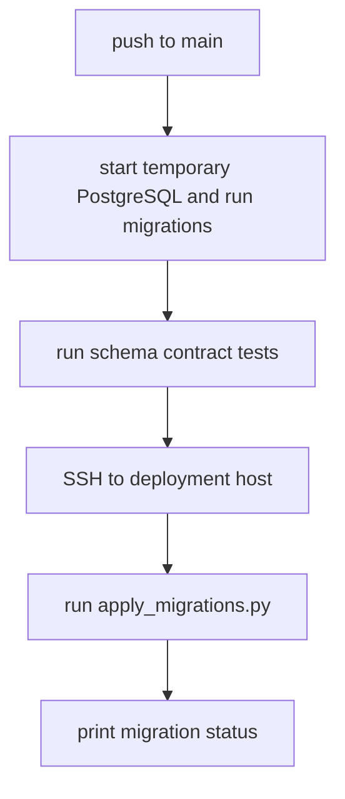

# Repo Design: dashcam-db-schema

Related docs: [overview](../multi-service-design.md), [shared contracts](../common/shared-contracts.md), [database schema](../common/database-schema.md), [operations](../common/operations.md).

## Purpose

`dashcam-db-schema` owns the PostgreSQL schema for the dashcam pipeline. It has no long-running runtime service. Its job is to version, test, and apply migrations to the existing database server.

Detailed schema definitions are in [../common/database-schema.md](../common/database-schema.md).

## Responsibilities

- Store SQL migrations.
- Apply migrations in order.
- Track applied migration versions.
- Provide schema tests.
- Document operator queries.
- Prevent runtime service repos from creating or modifying schema at startup.

## Non-Responsibilities

- Polling the dashcam.
- Downloading files.
- Uploading files.
- Cleaning local storage.
- Hosting application APIs.

## Repository

Repo name: `dashcam-db-schema`

```text
dashcam-db-schema/
|-- .github/workflows/deploy.yml
|-- config/
|   `-- app.env.example
|-- migrations/
|   |-- 001_create_schema_migrations.sql
|   |-- 002_create_dashcam_file_state.sql
|   |-- 003_create_dashcam_files.sql
|   |-- 004_create_dashcam_files_indexes.sql
|   `-- 005_create_updated_at_trigger.sql
|-- scripts/
|   |-- apply_migrations.py
|   |-- check_migrations.py
|   `-- dump_schema.py
|-- tests/
|   |-- test_migration_order.py
|   `-- test_schema_contract.py
|-- Dockerfile
|-- docker-compose.yml
|-- README.md
`-- requirements.txt
```

## Migration Tracking

Add a migration table before other migrations:

```sql
CREATE TABLE IF NOT EXISTS schema_migrations (
    version TEXT PRIMARY KEY,
    applied_at TIMESTAMPTZ NOT NULL DEFAULT now(),
    checksum TEXT NOT NULL
);
```

`apply_migrations.py` should:

1. Read `migrations/*.sql` sorted by filename.
2. Compute a checksum for each file.
3. Compare with `schema_migrations`.
4. Refuse to run if an applied migration checksum changed.
5. Apply unapplied migrations inside individual transactions.
6. Insert migration version and checksum after each successful migration.

## Deployment Flow



## Configuration

```env
DATABASE_URL=postgresql://mediawall:<password>@192.168.68.83:5432/mediawall
LOG_LEVEL=INFO
```

The deploy workflow should source `DATABASE_URL` from the production `config/app.env` on the deployment host, not from GitHub logs.

## GitHub Actions Pipeline

Stages:

1. Checkout.
2. Install dependencies.
3. Start temporary PostgreSQL service.
4. Apply all migrations to temporary DB.
5. Run schema contract tests.
6. Upload schema dump as artifact for review.
7. On `main`, sync repo to `/home/${DEPLOY_USER}/dashcam-db-schema`.
8. Run `scripts/apply_migrations.py`.
9. Run `scripts/check_migrations.py`.

The workflow should support manual dispatch with a `dry_run` input. Dry run prints pending migrations without applying them.

## Schema Contract Tests

Tests should assert:

- `dashcam_file_state` contains exactly the expected states.
- `dashcam_files.dashcam_path` is unique.
- `dashcam_files.state` is indexed.
- Download queue query uses an index.
- Upload queue query uses an index.
- Cleanup query uses an index.
- pCloud retention query uses an index.
- pCloud deletion metadata columns exist.
- `updated_at` changes on update.
- A duplicate `dashcam_path` upsert does not create two rows.

## Rollout

Initial rollout:

1. Confirm DB backup exists.
2. Apply schema migrations.
3. Run state count query; it should return zero rows or no rows.
4. Deploy poller.
5. Watch rows appear in `listed`.

Subsequent migrations:

- Additive migrations can deploy with normal push to `main`.
- Destructive migrations require manual approval and backup.
- Runtime services should be compatible with one schema version behind during rolling deploys.

## Acceptance Criteria

- A fresh DB can be migrated from zero to current schema.
- Production DB can apply migrations idempotently.
- Migration checks fail if an applied migration file changes.
- Runtime services can rely on `dashcam_files` existing before startup.
