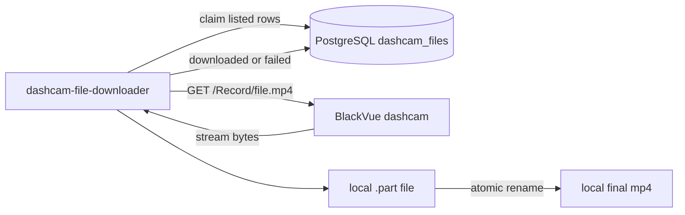
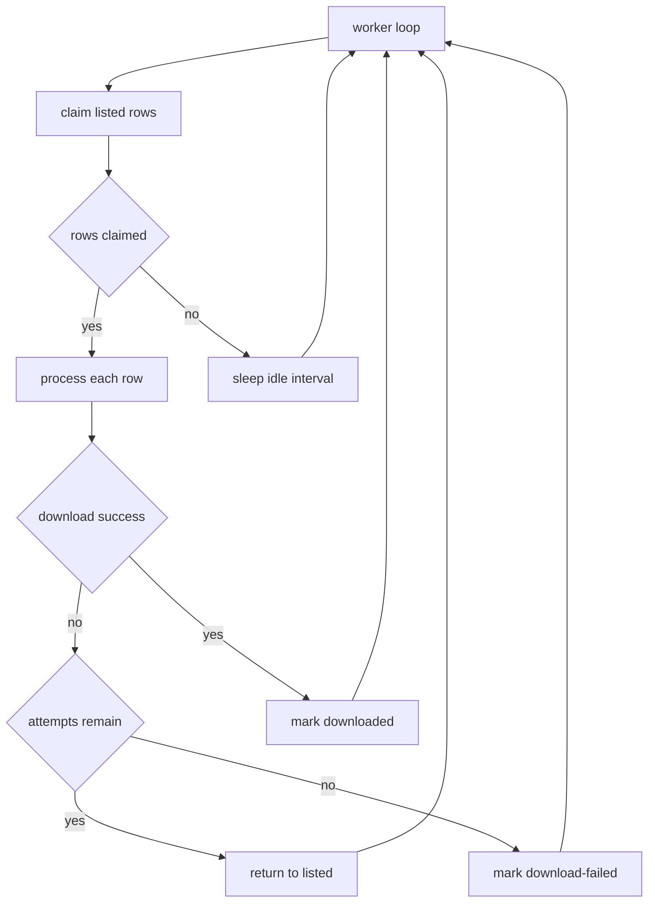

# Service Design: dashcam-file-downloader

Related docs: [overview](../multi-service-design.md), [shared contracts](../common/shared-contracts.md), [database schema](../common/database-schema.md), [operations](../common/operations.md).

## Purpose

`dashcam-file-downloader` consumes `listed` rows from PostgreSQL, downloads completed MP4 files from the dashcam to local storage, and marks rows as `downloaded` or `download-failed`.

This service is the only component that writes MP4 files to the local download volume.

## Responsibilities

- Claim `listed` rows using `FOR UPDATE SKIP LOCKED`.
- Mark claimed rows as `downloading`.
- Build dashcam file URLs from `dashcam_base_url` and `dashcam_path`.
- Stream downloads to `<target>.part`.
- Atomically rename `.part` files to final paths after successful transfer.
- Mark successful rows as `downloaded`.
- Mark exhausted failures as `download-failed`.
- Return retryable failures to `listed` while attempts remain.

## Runtime Architecture



## Repository

Repo name: `dashcam-file-downloader`

```text
dashcam-file-downloader/
|-- .github/workflows/deploy.yml
|-- config/
|   `-- app.env.example
|-- src/
|   |-- __init__.py
|   |-- config.py
|   |-- constants.py
|   |-- db.py
|   |-- downloader.py
|   |-- logging_config.py
|   |-- main.py
|   |-- models.py
|   `-- path_mapping.py
|-- tests/
|   |-- test_claims.py
|   |-- test_downloader.py
|   |-- test_path_mapping.py
|   `-- test_state_transitions.py
|-- Dockerfile
|-- docker-compose.yml
|-- README.md
`-- requirements.txt
```

## Configuration

```env
DATABASE_URL=postgresql://mediawall:<password>@192.168.68.22:5432/mediawall
DOWNLOAD_DIR=/downloads
WORKER_ID=dashcam-file-downloader-1
BATCH_SIZE=5
IDLE_SLEEP_SECONDS=10
REQUEST_TIMEOUT_SECONDS=30
MAX_DOWNLOAD_ATTEMPTS=3
RETRY_DELAY_SECONDS=10
LOG_LEVEL=INFO
```

Validation:

- `DOWNLOAD_DIR` must be an absolute path.
- `BATCH_SIZE` must be at least `1`.
- `MAX_DOWNLOAD_ATTEMPTS` must be at least `1`.
- `WORKER_ID` must not be empty.

## Business Logic

### Main Loop



### Claim Rows

```sql
WITH claimed AS (
    SELECT id
    FROM dashcam_files
    WHERE state = 'listed'
      AND download_attempts < %(max_attempts)s
    ORDER BY id
    LIMIT %(batch_size)s
    FOR UPDATE SKIP LOCKED
)
UPDATE dashcam_files f
SET
    state = 'downloading',
    download_attempts = f.download_attempts + 1,
    download_started_at = now(),
    locked_by = %(worker_id)s,
    locked_at = now(),
    last_error = NULL
FROM claimed
WHERE f.id = claimed.id
RETURNING f.*;
```

### Download Steps

1. Validate `dashcam_path`.
2. Map `/Record/file.mp4` to `DOWNLOAD_DIR/Record/file.mp4`.
3. If final file exists:
   - Get `stat().st_size`.
   - Mark row `downloaded`.
   - Do not redownload.
4. Remove stale `.part` from previous failed attempt, or overwrite it.
5. Stream HTTP response in chunks.
6. If `Content-Length` is present, verify written byte count matches it.
7. Rename `.part` to final path with `os.replace`.
8. Mark row `downloaded` with `local_path`, `local_size`, `downloaded_at`, `locked_by=NULL`, `locked_at=NULL`.

### Success Update

```sql
UPDATE dashcam_files
SET
    state = 'downloaded',
    local_path = %(local_path)s,
    local_size = %(local_size)s,
    downloaded_at = now(),
    locked_by = NULL,
    locked_at = NULL,
    last_error = NULL
WHERE id = %(id)s
  AND state = 'downloading';
```

### Failure Update

If attempts remain:

```sql
UPDATE dashcam_files
SET
    state = 'listed',
    locked_by = NULL,
    locked_at = NULL,
    last_error = %(last_error)s
WHERE id = %(id)s
  AND state = 'downloading';
```

If attempts are exhausted:

```sql
UPDATE dashcam_files
SET
    state = 'download-failed',
    locked_by = NULL,
    locked_at = NULL,
    last_error = %(last_error)s
WHERE id = %(id)s
  AND state = 'downloading';
```

## Local Storage Contract

Input:

```text
dashcam_path=/Record/20260602_074033_PF.mp4
DOWNLOAD_DIR=/downloads
```

Output:

```text
/downloads/Record/20260602_074033_PF.mp4
```

Temporary file:

```text
/downloads/Record/20260602_074033_PF.mp4.part
```

The final path must be stored exactly in `dashcam_files.local_path`.

## Error Handling

| Error | Behavior |
| --- | --- |
| Dashcam HTTP timeout | Retry internally, then return row to `listed` or `download-failed`. |
| HTTP 404 | Treat as retryable until attempts are exhausted. |
| Content-Length mismatch | Treat as failed transfer; do not create final file. |
| Local disk full | Mark retryable or failed; include path and OS error in `last_error`. |
| Unsafe path | Mark `download-failed`; this should not happen if poller validation works. |
| Worker crash while downloading | Row remains `downloading`; operator stale-row recovery requeues it. |

## Docker Compose

```yaml
services:
  dashcam-file-downloader:
    build: .
    container_name: dashcam-file-downloader
    env_file:
      - ./config/app.env
    volumes:
      - ./config:/app/config:ro
      - ./downloads:/downloads
    network_mode: host
    restart: unless-stopped
    labels:
      - "logging=promtail"
      - "service=dashcam-file-downloader"
      - "environment=production"
```

## GitHub Actions Pipeline

Stages:

1. Install dependencies.
2. Run unit tests.
3. Run integration tests with fake dashcam HTTP responses.
4. Validate Docker compose.
5. Deploy to `192.168.68.21:/home/${DEPLOY_USER}/dashcam-file-downloader`.
6. Preserve `config/app.env` and `downloads`.
7. Rebuild and restart container.
8. Print logs and `docker compose ps`.

The deploy sync must exclude `downloads` so production files are never deleted by `rsync --delete`.

## Test Plan

Unit tests:

- Claim query only selects `listed`.
- Multiple workers cannot claim the same row.
- Path mapping preserves `/Record`.
- Unsafe paths are rejected.
- Existing final file marks row downloaded.
- `.part` file is renamed only after complete transfer.
- Content-Length mismatch fails.
- Retryable failures return to `listed`.
- Exhausted failures become `download-failed`.

Integration tests:

- Fake HTTP server serves a small MP4 payload.
- Test DB row goes `listed -> downloading -> downloaded`.
- Simulate HTTP 500 and verify retry/failure path.
- Simulate worker crash by claiming a row and stopping before update; verify recovery query.

## Acceptance Criteria

- Downloaded files exist at configured local paths.
- No row is downloaded twice by concurrent workers.
- Existing local files can repair DB state by being marked `downloaded`.
- Failed downloads are visible in `download-failed` with useful `last_error`.
- The service can be stopped and restarted without losing queued work.
