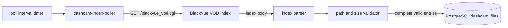
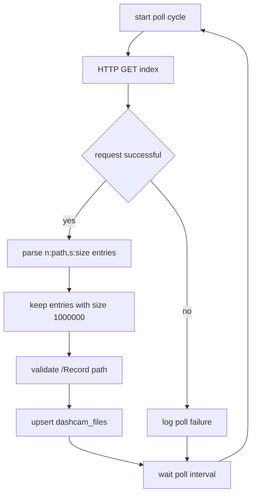

# Service Design: dashcam-index-poller

Related docs: [overview](../multi-service-design.md), [shared contracts](../common/shared-contracts.md), [database schema](../common/database-schema.md), [operations](../common/operations.md).

## Purpose

`dashcam-index-poller` discovers completed dashcam recordings. It polls the BlackVue VOD index, parses entries, filters for complete files, and upserts rows into PostgreSQL in `listed` state.

This service never downloads video content and never uploads or deletes files.

## Responsibilities

- Poll `DASHCAM_BASE_URL + DASHCAM_INDEX_PATH`.
- Parse inline, LF, and CRLF index response formats.
- Treat only `s:1000000` as complete and ready.
- Validate dashcam paths before inserting rows.
- Insert new complete files in `listed` state.
- Refresh `last_seen_at` for existing files.
- Log poll success, poll failure, inserted count, duplicate count, incomplete count, and invalid count.

## Non-Responsibilities

- Downloading MP4 files.
- Uploading to pCloud.
- Deleting local files.
- Creating database tables or running migrations.
- Resetting failed rows.

## Runtime Architecture



## Repository

Repo name: `dashcam-index-poller`

```text
dashcam-index-poller/
|-- .github/workflows/deploy.yml
|-- config/
|   `-- app.env.example
|-- src/
|   |-- __init__.py
|   |-- config.py
|   |-- constants.py
|   |-- db.py
|   |-- index_parser.py
|   |-- logging_config.py
|   |-- main.py
|   |-- models.py
|   `-- path_validation.py
|-- tests/
|   |-- test_index_parser.py
|   |-- test_path_validation.py
|   `-- test_poller.py
|-- Dockerfile
|-- docker-compose.yml
|-- README.md
`-- requirements.txt
```

## Configuration

```env
DATABASE_URL=postgresql://mediawall:<password>@192.168.68.22:5432/mediawall
DASHCAM_BASE_URL=http://192.168.68.17
DASHCAM_INDEX_PATH=/blackvue_vod.cgi
POLL_INTERVAL_SECONDS=60
COMPLETE_FILE_SIZE=1000000
REQUEST_TIMEOUT_SECONDS=30
WORKER_ID=dashcam-index-poller-1
LOG_LEVEL=INFO
```

Validation:

- `DASHCAM_BASE_URL` must include scheme and host.
- `DASHCAM_INDEX_PATH` must start with `/`.
- `POLL_INTERVAL_SECONDS` must be at least `1`.
- `COMPLETE_FILE_SIZE` must be `1000000` unless deliberately overridden for testing.

## Business Logic

### Poll Cycle



Algorithm:

1. Build `index_url` with `urljoin(DASHCAM_BASE_URL, DASHCAM_INDEX_PATH)`.
2. Fetch the index using `requests.Session.get(timeout=REQUEST_TIMEOUT_SECONDS)`.
3. On request failure, log and return without DB writes.
4. Parse entries using a regex that accepts:
   - `n:/Record/file.mp4,s:1000000`
   - Newline-delimited entries.
   - Space-delimited entries.
   - Entries missing `s:` for incomplete current files.
5. For each parsed entry:
   - Count it as incomplete if `size != COMPLETE_FILE_SIZE`.
   - Reject unsafe paths.
   - Extract `file_name` from the path.
6. Upsert complete valid rows.
7. Log aggregate counts for the poll.

### Safe Path Rules

Accept:

```text
/Record/20260602_074033_PF.mp4
/Record/subfolder/clip.mp4
```

Reject:

```text
Record/clip.mp4
/Other/clip.mp4
/Record/../clip.mp4
/Record/clip.mp4/
/Record\clip.mp4
```

## Database Writes

Upsert query:

```sql
INSERT INTO dashcam_files (
    dashcam_path,
    file_name,
    dashcam_size,
    dashcam_base_url,
    state,
    first_seen_at,
    last_seen_at
)
VALUES (
    %(dashcam_path)s,
    %(file_name)s,
    %(dashcam_size)s,
    %(dashcam_base_url)s,
    'listed',
    now(),
    now()
)
ON CONFLICT (dashcam_path) DO UPDATE
SET
    dashcam_size = EXCLUDED.dashcam_size,
    dashcam_base_url = EXCLUDED.dashcam_base_url,
    last_seen_at = now();
```

The conflict update must not reset `state`. A row that is already `downloaded`, `uploaded`, or failed should stay in its current state.

## Error Handling

| Error | Behavior |
| --- | --- |
| Dashcam offline | Log warning and wait for next poll. |
| HTTP 500 or timeout | Log warning and wait for next poll. |
| Malformed index body | Parse valid entries, log skipped count. |
| DB connection failure | Log error; next poll retries. |
| Duplicate path | Upsert refreshes `last_seen_at`. |

## Dockerfile

Use the same worker pattern as `stream-monitor`:

```dockerfile
FROM python:3.11-slim

WORKDIR /app
RUN groupadd -r appuser && useradd -r -g appuser appuser

COPY requirements.txt .
RUN pip install --no-cache-dir -r requirements.txt

COPY src/ ./src/
RUN mkdir -p /app/config && chown -R appuser:appuser /app

USER appuser
ENV PYTHONUNBUFFERED=1
ENV PYTHONPATH=/app

CMD ["python", "-m", "src.main"]
```

## docker-compose.yml

```yaml
services:
  dashcam-index-poller:
    build: .
    container_name: dashcam-index-poller
    env_file:
      - ./config/app.env
    volumes:
      - ./config:/app/config:ro
    network_mode: host
    restart: unless-stopped
    labels:
      - "logging=promtail"
      - "service=dashcam-index-poller"
      - "environment=production"
```

## GitHub Actions Pipeline

Pipeline stages:

1. Checkout.
2. Install Python dependencies.
3. Run parser, path validation, and poller tests.
4. Sync files to `~/dashcam-index-poller` on `192.168.68.21`.
5. Create `config/app.env` from example if missing.
6. Run `docker compose config --quiet`.
7. Build and restart container.
8. Print the last 50 log lines.

Deploy path:

```text
192.168.68.21:/home/${DEPLOY_USER}/dashcam-index-poller
```

## Test Plan

Unit tests:

- Parse newline-delimited index.
- Parse inline index.
- Parse CRLF index.
- Treat only `s:1000000` as complete.
- Ignore missing or malformed `s:`.
- Reject unsafe paths.
- Upsert does not reset state on conflict.

Integration tests:

- Use a fake HTTP server returning sample index bodies.
- Use a temporary PostgreSQL container or transaction-scoped test DB.
- Verify first poll inserts rows.
- Verify second poll updates `last_seen_at` and does not duplicate rows.
- Verify offline dashcam does not mutate DB.

## Acceptance Criteria

- New complete dashcam files appear in `dashcam_files` with `state='listed'`.
- Existing rows are not reset by duplicate listings.
- Incomplete entries are skipped until they later appear with `s:1000000`.
- The service can run continuously without memory growth from storing previously seen paths in process memory.
- All state is recoverable from PostgreSQL after restart.
