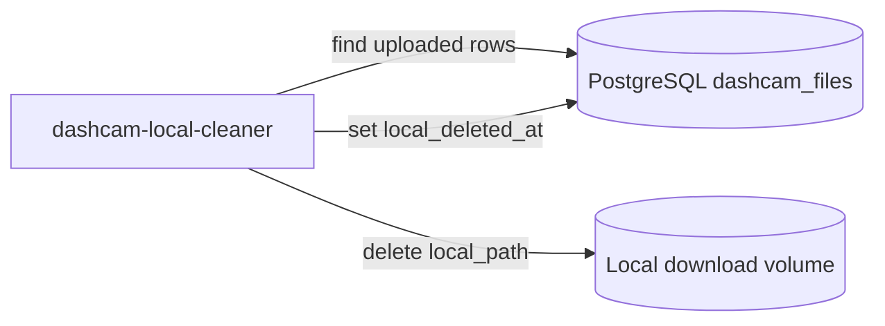
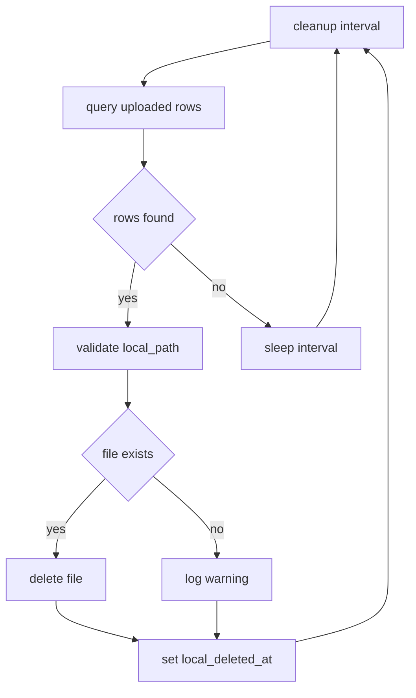

# Service Design: dashcam-local-cleaner

Related docs: [overview](../multi-service-design.md), [shared contracts](../common/shared-contracts.md), [database schema](../common/database-schema.md), [operations](../common/operations.md).

## Purpose

`dashcam-local-cleaner` deletes local MP4 files after they have been uploaded to pCloud. It only processes rows in `uploaded` state and records cleanup by setting `local_deleted_at`.

This service never changes upload or download state.

## Responsibilities

- Query uploaded rows with local files that have not been cleaned.
- Validate `local_path` is inside `DOWNLOAD_DIR`.
- Delete the local file.
- Treat already-missing files as cleaned.
- Set `local_deleted_at`.
- Leave `.part` files alone.

## Runtime Architecture



## Repository

Repo name: `dashcam-local-cleaner`

```text
dashcam-local-cleaner/
|-- .github/workflows/deploy.yml
|-- config/
|   `-- app.env.example
|-- src/
|   |-- __init__.py
|   |-- cleaner.py
|   |-- config.py
|   |-- constants.py
|   |-- db.py
|   |-- logging_config.py
|   |-- main.py
|   |-- models.py
|   `-- path_validation.py
|-- tests/
|   |-- test_cleaner.py
|   |-- test_claims.py
|   `-- test_path_validation.py
|-- Dockerfile
|-- docker-compose.yml
|-- README.md
`-- requirements.txt
```

## Configuration

```env
DATABASE_URL=postgresql://mediawall:<password>@192.168.68.22:5432/mediawall
DOWNLOAD_DIR=/downloads
WORKER_ID=dashcam-local-cleaner-1
BATCH_SIZE=100
CLEANUP_INTERVAL_SECONDS=300
LOG_LEVEL=INFO
```

Validation:

- `DOWNLOAD_DIR` must be absolute.
- `BATCH_SIZE` must be at least `1`.
- `CLEANUP_INTERVAL_SECONDS` must be at least `1`.

## Business Logic

### Cleanup Loop



### Select Rows

```sql
WITH claimed AS (
    SELECT id
    FROM dashcam_files
    WHERE state = 'uploaded'
      AND local_path IS NOT NULL
      AND local_deleted_at IS NULL
    ORDER BY uploaded_at NULLS LAST, id
    LIMIT %(batch_size)s
    FOR UPDATE SKIP LOCKED
)
SELECT f.*
FROM dashcam_files f
JOIN claimed ON claimed.id = f.id;
```

The cleaner can hold the transaction while deleting files only if batch sizes are small. Prefer selecting claimed ids in one transaction, deleting files outside the transaction, then updating rows individually. If multiple cleaner instances may run, add a short-lived `locked_by`/`locked_at` update similar to downloader claims.

### Mark Cleaned

```sql
UPDATE dashcam_files
SET
    local_deleted_at = now(),
    locked_by = NULL,
    locked_at = NULL,
    last_error = NULL
WHERE id = %(id)s
  AND state = 'uploaded'
  AND local_deleted_at IS NULL;
```

## Path Safety

Rules:

- `local_path` must be absolute.
- `local_path` must resolve under `DOWNLOAD_DIR`.
- `local_path` must not end with `.part`.
- Directories are never deleted.
- Parent directories may be left in place. Optional empty directory cleanup can be added later.

Unsafe rows should not be deleted. They should be logged as errors and left with `local_deleted_at IS NULL` for operator inspection.

## Error Handling

| Error | Behavior |
| --- | --- |
| File missing | Log warning and mark cleaned. |
| Permission denied | Log error; do not mark cleaned. |
| Path outside download root | Log error; do not delete or mark cleaned. |
| Directory instead of file | Log error; do not delete or mark cleaned. |
| DB update failure after delete | Log critical error; next run sees missing file and marks cleaned. |

## Docker Compose

```yaml
services:
  dashcam-local-cleaner:
    build: .
    container_name: dashcam-local-cleaner
    env_file:
      - ./config/app.env
    volumes:
      - ./config:/app/config:ro
      - ./downloads:/downloads
    network_mode: host
    restart: unless-stopped
    labels:
      - "logging=promtail"
      - "service=dashcam-local-cleaner"
      - "environment=production"
```

The cleaner needs write access to `DOWNLOAD_DIR`.

## GitHub Actions Pipeline

Stages:

1. Install dependencies.
2. Run unit tests.
3. Run filesystem safety tests.
4. Validate Docker compose.
5. Deploy to `192.168.68.21:/home/${DEPLOY_USER}/dashcam-local-cleaner`.
6. Preserve `config/app.env` and `downloads`.
7. Build and restart container.

The deployment must not delete the production `downloads` directory.

## Test Plan

Unit tests:

- Select query only finds `uploaded` rows.
- Missing file marks cleaned.
- Existing file is deleted and marked cleaned.
- `.part` files are refused.
- Paths outside `DOWNLOAD_DIR` are refused.
- Permission errors leave `local_deleted_at` null.

Integration tests:

- Create temporary local file and DB row.
- Run cleaner once.
- Assert file is gone and `local_deleted_at` is set.
- Run cleaner again and assert idempotence.

## Acceptance Criteria

- Uploaded files are deleted locally only after `uploaded_at` exists.
- Cleaner never deletes outside `DOWNLOAD_DIR`.
- Cleaner never deletes `.part` files.
- Missing files do not block cleanup state.
- Cleanup can run repeatedly without changing already cleaned rows.
