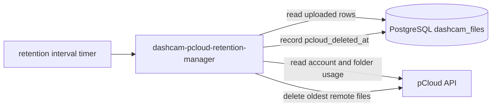
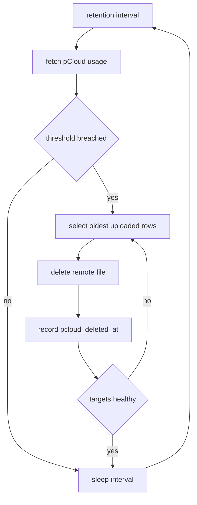

# Service Design: dashcam-pcloud-retention-manager

Related docs: [overview](../multi-service-design.md), [shared contracts](../common/shared-contracts.md), [database schema](../common/database-schema.md), [operations](../common/operations.md).

## Purpose

`dashcam-pcloud-retention-manager` controls pCloud storage growth. It monitors the configured pCloud destination folder and overall pCloud account free space, then deletes the oldest uploaded dashcam files when either retention threshold is breached.

This service deletes files from pCloud only. It does not delete local files and does not alter the download/upload pipeline state.

## Responsibilities

- Query pCloud account storage usage.
- Query pCloud folder contents under `PCLOUD_DESTINATION_ROOT`.
- Calculate folder size and overall free-space percentage.
- Decide whether retention cleanup is required.
- Select the oldest uploaded files that still exist in pCloud.
- Delete pCloud files until configured targets are healthy again.
- Set `pcloud_deleted_at`, `pcloud_delete_reason`, and `pcloud_deleted_by` in PostgreSQL.
- Leave DB rows in `uploaded` state for audit history.

## Non-Responsibilities

- Uploading files to pCloud.
- Downloading files from the dashcam.
- Deleting local files.
- Resetting upload failures.
- Deleting rows from PostgreSQL.

## Runtime Architecture



## Repository

Repo name: `dashcam-pcloud-retention-manager`

```text
dashcam-pcloud-retention-manager/
|-- .github/workflows/deploy.yml
|-- config/
|   `-- app.env.example
|-- src/
|   |-- __init__.py
|   |-- config.py
|   |-- constants.py
|   |-- db.py
|   |-- logging_config.py
|   |-- main.py
|   |-- models.py
|   |-- pcloud_client.py
|   `-- retention.py
|-- tests/
|   |-- test_pcloud_client.py
|   |-- test_retention_policy.py
|   |-- test_retention_selection.py
|   `-- test_state_updates.py
|-- Dockerfile
|-- docker-compose.yml
|-- README.md
`-- requirements.txt
```

## Configuration

```env
DATABASE_URL=postgresql://mediawall:<password>@192.168.68.83:5432/mediawall
PCLOUD_USERNAME=<set-username>
PCLOUD_PASSWORD=<set-password>
PCLOUD_DESTINATION_ROOT=/Dashcam
PCLOUD_MAX_FOLDER_BYTES=536870912000
PCLOUD_TARGET_FOLDER_BYTES=483183820800
PCLOUD_MIN_FREE_PERCENT=10
PCLOUD_TARGET_FREE_PERCENT=15
RETENTION_INTERVAL_SECONDS=3600
BATCH_SIZE=100
MAX_DELETES_PER_RUN=500
REQUEST_TIMEOUT_SECONDS=60
WORKER_ID=dashcam-pcloud-retention-manager-1
LOG_LEVEL=INFO
```

Defaults:

- `PCLOUD_MAX_FOLDER_BYTES`: 500 GiB.
- `PCLOUD_TARGET_FOLDER_BYTES`: 90 percent of `PCLOUD_MAX_FOLDER_BYTES`.
- `PCLOUD_MIN_FREE_PERCENT`: 10.
- `PCLOUD_TARGET_FREE_PERCENT`: `PCLOUD_MIN_FREE_PERCENT + 5`.

Validation:

- `PCLOUD_DESTINATION_ROOT` must start with `/`.
- `PCLOUD_TARGET_FOLDER_BYTES` must be less than or equal to `PCLOUD_MAX_FOLDER_BYTES`.
- `PCLOUD_TARGET_FREE_PERCENT` must be greater than or equal to `PCLOUD_MIN_FREE_PERCENT`.
- `MAX_DELETES_PER_RUN` must be at least `1`.

## Retention Policy

Cleanup starts when either condition is true:

```text
pcloud folder size >= PCLOUD_MAX_FOLDER_BYTES
overall pCloud free percentage < PCLOUD_MIN_FREE_PERCENT
```

Cleanup stops when both conditions are true:

```text
pcloud folder size <= PCLOUD_TARGET_FOLDER_BYTES
overall pCloud free percentage >= PCLOUD_TARGET_FREE_PERCENT
```

The difference between trigger and target values creates hysteresis, so the service does not delete one file every interval while hovering around a threshold.

## Business Logic

### Main Loop



### Candidate Selection

The service should use database records as the authoritative ordered list of files it is allowed to delete. It should only delete rows that:

- `state = 'uploaded'`
- `pcloud_path IS NOT NULL`
- `pcloud_deleted_at IS NULL`
- `uploaded_at IS NOT NULL`

Query:

```sql
SELECT id, dashcam_path, pcloud_path, pcloud_file_id, pcloud_size, uploaded_at
FROM dashcam_files
WHERE state = 'uploaded'
  AND pcloud_path IS NOT NULL
  AND pcloud_deleted_at IS NULL
ORDER BY uploaded_at ASC, id ASC
LIMIT %(batch_size)s;
```

The pCloud API is still queried before deletion to confirm the file exists and to refresh size metadata when available.

### Delete Decision

For each candidate:

1. Confirm thresholds are still breached.
2. Confirm `pcloud_path` is under `PCLOUD_DESTINATION_ROOT`.
3. Check remote file metadata.
4. If the remote file is missing, record `pcloud_deleted_at` with reason `already_missing`.
5. If the remote file exists, delete it through the pCloud API.
6. Record deletion metadata in PostgreSQL.
7. Recalculate or decrement usage counters.
8. Stop after targets are healthy or `MAX_DELETES_PER_RUN` is reached.

### Deletion Update

```sql
UPDATE dashcam_files
SET
    pcloud_deleted_at = now(),
    pcloud_delete_reason = %(reason)s,
    pcloud_deleted_by = %(worker_id)s,
    last_error = NULL
WHERE id = %(id)s
  AND state = 'uploaded'
  AND pcloud_deleted_at IS NULL;
```

The row remains `uploaded` because upload completed successfully. Current pCloud presence is represented by `pcloud_deleted_at IS NULL`.

## pCloud Client Requirements

The client wrapper should expose:

```python
class PCloudClient:
    def get_account_usage(self) -> AccountUsage: ...
    def get_folder_usage(self, root_path: str) -> FolderUsage: ...
    def stat_file(self, path: str, file_id: str | None = None) -> RemoteFile | None: ...
    def delete_file(self, path: str, file_id: str | None = None) -> None: ...
```

Models:

```python
@dataclass(frozen=True)
class AccountUsage:
    used_bytes: int
    quota_bytes: int

    @property
    def free_percent(self) -> float:
        return ((self.quota_bytes - self.used_bytes) / self.quota_bytes) * 100

@dataclass(frozen=True)
class FolderUsage:
    path: str
    size_bytes: int
    file_count: int
```

## Safety Rules

- Never delete remote paths outside `PCLOUD_DESTINATION_ROOT`.
- Never delete rows that are not `uploaded`.
- Never delete rows where `pcloud_deleted_at` is already set.
- Never delete local files.
- Never delete pCloud folders, only files.
- If pCloud metadata conflicts with DB metadata, log the conflict and skip the row unless the file is already missing.

## Error Handling

| Error | Behavior |
| --- | --- |
| pCloud auth failure | Re-authenticate once, then abort the run. |
| pCloud rate limit | Stop the run and try next interval. |
| Remote file missing | Mark `pcloud_deleted_at` with reason `already_missing`. |
| Remote path outside root | Skip row and set `last_error`; do not delete. |
| DB update fails after pCloud delete | Log critical error; next run should see missing remote file and mark deleted. |
| Threshold still breached after max deletes | Log warning with remaining folder size and free percent. |

## Docker Compose

```yaml
services:
  dashcam-pcloud-retention-manager:
    build: .
    container_name: dashcam-pcloud-retention-manager
    env_file:
      - ./config/app.env
    volumes:
      - ./config:/app/config:ro
    network_mode: host
    restart: unless-stopped
    labels:
      - "logging=promtail"
      - "service=dashcam-pcloud-retention-manager"
      - "environment=production"
```

This service does not need the local download volume.

## GitHub Actions Pipeline

Stages:

1. Install dependencies.
2. Run unit tests.
3. Run retention policy tests.
4. Run pCloud client tests with mocked API responses.
5. Run DB update tests against temporary PostgreSQL.
6. Validate Docker compose.
7. Deploy to `/home/${DEPLOY_USER}/dashcam-pcloud-retention-manager`.
8. Preserve `config/app.env`.
9. Build and restart container.

## Test Plan

Unit tests:

- Folder-size trigger starts cleanup.
- Free-percent trigger starts cleanup.
- Cleanup stops at target folder bytes.
- Cleanup stops at target free percentage.
- Oldest uploaded rows are selected first.
- Already deleted rows are ignored.
- Remote paths outside root are refused.
- Missing remote files are marked deleted without failing the run.
- `MAX_DELETES_PER_RUN` is enforced.

Integration tests:

- Mock pCloud account and folder usage.
- Insert uploaded DB rows with pCloud paths.
- Run one retention pass.
- Verify oldest rows are marked with `pcloud_deleted_at`.
- Verify state remains `uploaded`.

## Acceptance Criteria

- pCloud retention never deletes outside `PCLOUD_DESTINATION_ROOT`.
- Oldest uploaded files are deleted first.
- Deletion metadata is recorded in PostgreSQL.
- The service stops deleting once both configured targets are healthy.
- The service can run independently from uploader and cleaner.

