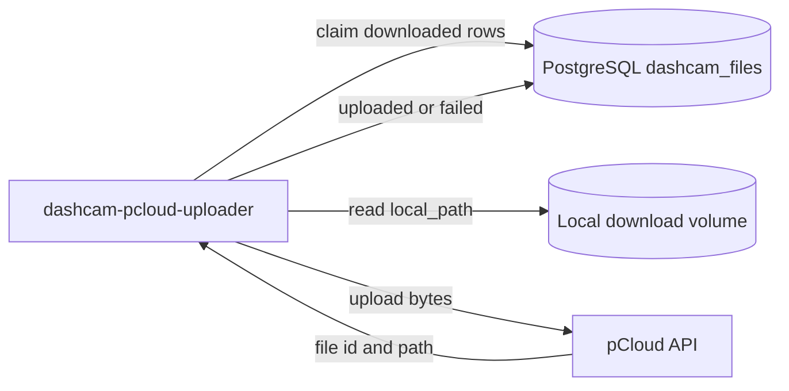
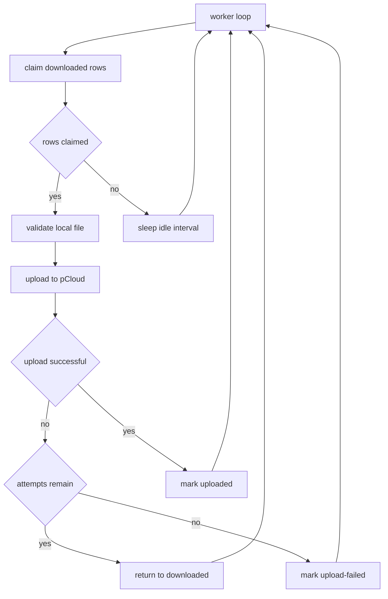

# Service Design: dashcam-pcloud-uploader

Related docs: [overview](../multi-service-design.md), [shared contracts](../common/shared-contracts.md), [database schema](../common/database-schema.md), [operations](../common/operations.md).

## Purpose

`dashcam-pcloud-uploader` consumes `downloaded` rows from PostgreSQL, uploads the local MP4 file to pCloud, and marks rows as `uploaded` or `upload-failed`.

This service is the only component that writes to pCloud.

## Responsibilities

- Claim `downloaded` rows using `FOR UPDATE SKIP LOCKED`.
- Mark claimed rows as `uploading`.
- Verify `local_path` exists and is inside the expected download root.
- Upload files to `PCLOUD_DESTINATION_ROOT`.
- Preserve the relative local path in pCloud by default.
- Store `pcloud_path`, `pcloud_file_id`, and `pcloud_size` after successful upload.
- Mark successful rows as `uploaded`.
- Mark exhausted failures as `upload-failed`.
- Return retryable failures to `downloaded` while attempts remain.

## Runtime Architecture



## Repository

Repo name: `dashcam-pcloud-uploader`

```text
dashcam-pcloud-uploader/
|-- .github/workflows/deploy.yml
|-- config/
|   `-- app.env.example
|-- src/
|   |-- __init__.py
|   |-- config.py
|   |-- constants.py
|   |-- db.py
|   |-- logging_config.py
|   |-- main.py
|   |-- models.py
|   |-- path_mapping.py
|   `-- pcloud_client.py
|-- tests/
|   |-- test_claims.py
|   |-- test_path_mapping.py
|   |-- test_pcloud_client.py
|   `-- test_state_transitions.py
|-- Dockerfile
|-- docker-compose.yml
|-- README.md
`-- requirements.txt
```

## Configuration

```env
DATABASE_URL=postgresql://mediawall:<password>@192.168.68.83:5432/mediawall
DOWNLOAD_DIR=/downloads
PCLOUD_USERNAME=<set-username>
PCLOUD_PASSWORD=<set-password>
PCLOUD_DESTINATION_ROOT=/Dashcam
WORKER_ID=dashcam-pcloud-uploader-1
BATCH_SIZE=2
IDLE_SLEEP_SECONDS=15
MAX_UPLOAD_ATTEMPTS=3
RETRY_DELAY_SECONDS=30
REQUEST_TIMEOUT_SECONDS=60
LOG_LEVEL=INFO
```

Validation:

- `DOWNLOAD_DIR` must be absolute.
- `PCLOUD_DESTINATION_ROOT` must start with `/`.
- pCloud credentials must not be placeholders at runtime.
- `MAX_UPLOAD_ATTEMPTS` must be at least `1`.

## Business Logic

### Main Loop



### Claim Rows

```sql
WITH claimed AS (
    SELECT id
    FROM dashcam_files
    WHERE state = 'downloaded'
      AND upload_attempts < %(max_attempts)s
    ORDER BY id
    LIMIT %(batch_size)s
    FOR UPDATE SKIP LOCKED
)
UPDATE dashcam_files f
SET
    state = 'uploading',
    upload_attempts = f.upload_attempts + 1,
    upload_started_at = now(),
    locked_by = %(worker_id)s,
    locked_at = now(),
    last_error = NULL
FROM claimed
WHERE f.id = claimed.id
RETURNING f.*;
```

### pCloud Path Mapping

Default mapping:

```text
DOWNLOAD_DIR=/downloads
local_path=/downloads/Record/20260602_074033_PF.mp4
PCLOUD_DESTINATION_ROOT=/Dashcam
pcloud_path=/Dashcam/Record/20260602_074033_PF.mp4
```

Rules:

- Local file must be inside `DOWNLOAD_DIR`.
- Relative path is calculated from `DOWNLOAD_DIR`.
- pCloud path uses POSIX separators.
- Destination folders are created if missing.
- If the destination file exists and size matches, treat it as success.

### Success Update

```sql
UPDATE dashcam_files
SET
    state = 'uploaded',
    pcloud_path = %(pcloud_path)s,
    pcloud_file_id = %(pcloud_file_id)s,
    pcloud_size = %(pcloud_size)s,
    uploaded_at = now(),
    locked_by = NULL,
    locked_at = NULL,
    last_error = NULL
WHERE id = %(id)s
  AND state = 'uploading';
```

### Failure Update

If attempts remain:

```sql
UPDATE dashcam_files
SET
    state = 'downloaded',
    locked_by = NULL,
    locked_at = NULL,
    last_error = %(last_error)s
WHERE id = %(id)s
  AND state = 'uploading';
```

If attempts are exhausted:

```sql
UPDATE dashcam_files
SET
    state = 'upload-failed',
    locked_by = NULL,
    locked_at = NULL,
    last_error = %(last_error)s
WHERE id = %(id)s
  AND state = 'uploading';
```

## pCloud Client Requirements

The client wrapper should expose:

```python
class PCloudClient:
    def ensure_folder(self, path: str) -> None: ...
    def file_exists_with_size(self, path: str, size: int) -> bool: ...
    def upload_file(self, local_path: Path, remote_path: str) -> UploadedFile: ...
```

`UploadedFile` should include:

- `path`
- `file_id` if provided by pCloud
- `size`

Authentication should be created once per process and reused. If pCloud returns an auth/session expiry error, the client should refresh authentication once before failing the attempt.

## Error Handling

| Error | Behavior |
| --- | --- |
| Local file missing | Mark retryable or `upload-failed`; operator can reset to `listed` to redownload. |
| Local path outside download root | Mark `upload-failed`; this is a safety violation. |
| pCloud auth failure | Retry after re-auth; fail attempt if still rejected. |
| pCloud rate limit | Sleep `RETRY_DELAY_SECONDS`, then retry while attempt budget remains. |
| Destination exists with same size | Treat as uploaded and update DB. |
| Destination exists with different size | Fail attempt and record conflict in `last_error`. |
| Worker crash while uploading | Row remains `uploading`; operator stale-row recovery requeues it. |

## Docker Compose

```yaml
services:
  dashcam-pcloud-uploader:
    build: .
    container_name: dashcam-pcloud-uploader
    env_file:
      - ./config/app.env
    volumes:
      - ./config:/app/config:ro
      - ./downloads:/downloads:ro
    network_mode: host
    restart: unless-stopped
    labels:
      - "logging=promtail"
      - "service=dashcam-pcloud-uploader"
      - "environment=production"
```

The local download volume can be mounted read-only because the uploader only reads files.

## GitHub Actions Pipeline

Stages:

1. Install dependencies.
2. Run unit tests.
3. Run pCloud client tests with mocked API responses.
4. Run DB claim/state transition tests.
5. Validate Docker compose.
6. Deploy to `/home/${DEPLOY_USER}/dashcam-pcloud-uploader`.
7. Preserve `config/app.env`.
8. Rebuild and restart container.

pCloud credentials must never be printed. Tests should use fake credentials and mocked HTTP responses.

## Test Plan

Unit tests:

- Claim query only selects `downloaded`.
- Path mapping preserves relative layout.
- Missing local file transitions correctly.
- Existing remote same-size file marks success.
- Existing remote different-size file fails.
- Retryable failures return to `downloaded`.
- Exhausted failures become `upload-failed`.

Integration tests:

- Use a temporary local file.
- Mock pCloud upload endpoint.
- Verify DB row goes `downloaded -> uploading -> uploaded`.
- Verify pCloud path and file id are stored.

## Acceptance Criteria

- Uploaded rows contain `pcloud_path`, `pcloud_size`, and `uploaded_at`.
- Cleaner can safely process uploaded rows after uploader completion.
- Concurrent uploader instances do not claim the same row.
- Secrets are read only from runtime config or deployment secrets.
- Failed uploads contain actionable `last_error` values.
